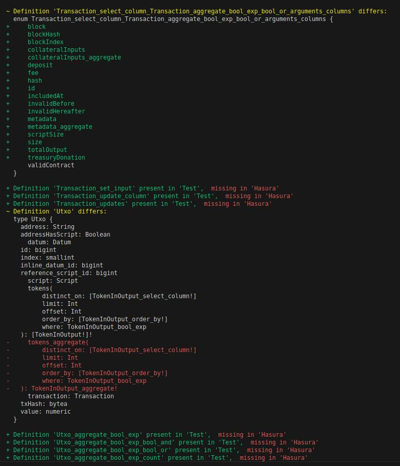

# Example of a Hasura-based GraphQL schema for testing/dev purposes

"Decoding the logic" behind Hasura introspection and schema generation

## schemas/: Example of a Hasura-based GraphQL schema for testing/dev purposes

This example case is a Hasura-generated schema and the final "wrapped" schema from it that is used on production on a project.

### Files
- `schemas/hasura.graphql`            :Hasura-generated schema in graphql format captured using  `gql-sdl`
- `schemas/hasura.json`               :Hasura-generated schema in json format captured using  `gql-sdl`
- `schemas/db.sql`                    :PostgresDB `public` schema in postgresql feeding Hasura
- `schemas/db.json`                   :PostgresDB `public` schema in a custom JSON format feeding `scripts/generateHasuraSchema.ts`

### Other files
- `schemas/wrapped-hasura.graphql`    :final schema wrapping hasura's one, in graphql format captured using  `gql-sdl`
- `schemas/wrapped-hasura.json`       :final schema wrapping hasura's one, in json format captured using  `gql-sdl`

#### Notes
The final production API, namely `wrapped-hasura.*` is in general terms a wrapped Hasura-generated schema with customizations:
- not exposing mutations and subscriptions from `hasura.*` generated schema 
- not exposing most of the query root fields generated upon the db tables on `public` db schema (mostly snake case)
- exposing the root fields that where generated upon the db views on `public` db schema (pascal case plus some exceptions like `utxo` view)
- exposing the root field that where generated upon the db table `Asset` on `public`
- exposing the root field that where generated upon the db view `utxo` on `public`
- adding a couple of custom root fields like `Query.PaymentAddresses` and `Mutation.submitTransaction`
- it has **recursive/nested filtering** arguments and **aggregations** exposed as separate root fields with the prefix `_aggregate`

## scripts/: alternative Hasura schema reconstruction and gql smart diff tools

### About this script:

The `scripts/generateHasuraSchema.ts` script aims to generate the same Hasura generated gql schema using same inputs they are using from a project in production. Is a quick solution based on text templates, without a proper gql node dependency tree, a work in progress!!! 
In order to tackle this complex task I made a smart .graphql schema file diff tool with dynamic test case selection presets

📐 to generate, validate and fully compare with Hasura reference file run the shortcut `npm run test`

### How to run

```sh

    # Install, generate output/hasura.graphql and run a diff comparing with reference hasura file: schemas/hasura.graphql
    npm install
    npm npm run test
    
    # Read the notes!
    npm run notes:hasura

```


### Screenshot


